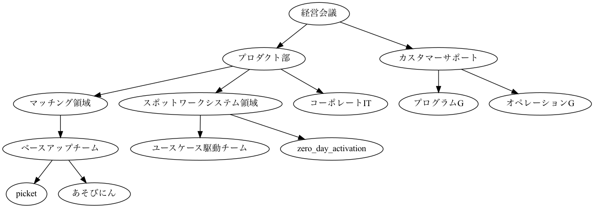

# GraphQLを触ってみた

DBの構造と、発行するクエリに差分があった方が、GraphQLのテストとして良いなと思ったので、木構造を触ることに
閉包テーブル（closure table）を扱うgemである、[closure_tree](https://github.com/ClosureTree/closure_tree) を入れて触ってみた。
以下のような組織図を表すデータをseedに入れている。



## テストした内容

### Case1

 Query

```js
{
  rootOrganizations {
    id
    name
  }
}
```

#### Result

```json
{
  "data": {
    "rootOrganizations": [
      {
        "id": "1",
        "name": "経営会議"
      },
      {
        "id": "14",
        "name": "z_club_スノボ"
      }
    ]
  }
}
```

### Case2

#### Query

```js
{
  children(parentId: 2) {
    id
    name
    parent {
      id
      name
      parent {
        id
        name
        children{
          id
          name
  	    }
      }
    }
  }
}
```

#### Result

```json
{
  "data": {
    "children": [
      {
        "id": "3",
        "name": "マッチング領域",
        "parent": {
          "id": "2",
          "name": "プロダクト部",
          "parent": {
            "id": "1",
            "name": "経営会議",
            "children": [
              {
                "id": "2",
                "name": "プロダクト部"
              },
              {
                "id": "11",
                "name": "カスタマーサポート"
              }
            ]
          }
        }
      },
      {
        "id": "7",
        "name": "スポットワークシステム領域",
        "parent": {
          "id": "2",
          "name": "プロダクト部",
          "parent": {
            "id": "1",
            "name": "経営会議",
            "children": [
              {
                "id": "2",
                "name": "プロダクト部"
              },
              {
                "id": "11",
                "name": "カスタマーサポート"
              }
            ]
          }
        }
      },
      {
        "id": "10",
        "name": "コーポレートIT",
        "parent": {
          "id": "2",
          "name": "プロダクト部",
          "parent": {
            "id": "1",
            "name": "経営会議",
            "children": [
              {
                "id": "2",
                "name": "プロダクト部"
              },
              {
                "id": "11",
                "name": "カスタマーサポート"
              }
            ]
          }
        }
      }
    ]
  }
}
```

# 感想など

- 結構柔軟に扱えて良さそう。
- 特にフロントエンドにUsercaseを寄せられそうで良さそう。
- ファイルのスコープや名前空間に関しては結構気をつけた方が良さそう。[Resolver](https://graphql-ruby.org/fields/resolvers.html)などで一定認知負荷は減らせそうだけども。
  - 必要に応じて、実は複数エンドポイント作った方がいいかもしれないし（そうでもないかもしれない）
- [名前空間](https://github.com/graphql/graphql-spec/issues/163)の議論は面白そうなので読む
